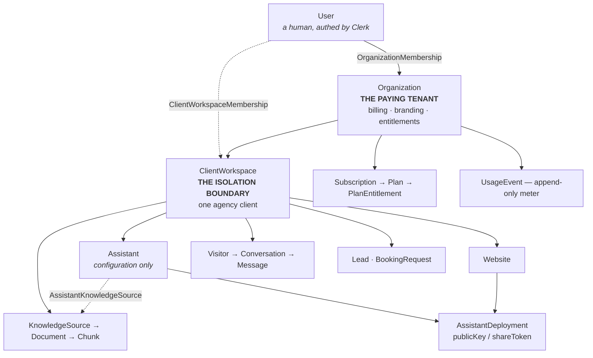

# Technical architecture — current state

**Snapshot:** 2026-08-05, 12:43 PDT · commit `05f5f0f` · deployed at chatdock.io

Everything here was extracted from the code on the date above. Counts and lists
are generated, not remembered. Where this disagrees with an older document,
this one is correct.

Entry point for newcomers: [`START-HERE.md`](START-HERE.md).
Deeper narrative on lifecycles and gotchas: [`ENGINEERING-HANDOFF.md`](ENGINEERING-HANDOFF.md).

---

## 1. Stack

| Layer | Choice | Notes |
|---|---|---|
| Framework | Next.js 15.5.7, App Router | Server Actions enabled (experimental flag) |
| Language | TypeScript | 244 `.ts`/`.tsx` files under `src/` |
| Database | PostgreSQL on Supabase | `pgvector` with an HNSW cosine index |
| ORM | Prisma 5.18 | 32 models, 42 enums |
| Auth | Clerk | `clerkMiddleware`, public-route allow-list |
| Embeddings | OpenAI `text-embedding-3-small` | 1536 dimensions |
| LLM | Gemini `gemini-2.5-flash-lite` (default) | key read from **two** env names |
| Crawling | Firecrawl | `src/lib/firecrawl.ts` |
| Reranking | Jina | `src/lib/jina-reranker.ts` |
| Billing | Dodo Payments | configured, never transacted |
| Realtime | Pusher | **half-wired** — see §7 |
| Hosting | Vercel | auto-deploys `master` |

---

## 2. The tenancy model — read this before anything else



**Three rules that explain most of the schema:**

1. **`Organization` pays.** Billing, white-labelling and entitlements attach
   here, never to a `User`.
2. **`ClientWorkspace` is the isolation boundary.** Every row a request can read
   carries `clientWorkspaceId` **directly**, even when reachable through a
   parent. That denormalisation is deliberate: every query filters the tenant in
   its own `WHERE` rather than trusting a join.
3. **`Assistant` is separate from `AssistantDeployment`.** The assistant is
   configuration; the deployment is where and how it is reachable. That split is
   what makes preview links, prospect demos and a future voice channel possible
   without duplicating config.

**Cascade policy:** memberships cascade from both ends; anything *authored* by a
user uses `SetNull` so history survives offboarding; tenant roots soft-delete via
`deletedAt`. Deleting a person must never delete a business.

---

## 3. Database — all 32 models

Field counts are actual. Grouped by concern.

### Identity and tenancy (5)

| Model | Fields | Purpose |
|---|---|---|
| `User` | 22 | Clerk-backed person. Owns nothing directly. |
| `Organization` | 25 | The paying tenant. `organizationType` = `agency` \| `direct_business`. |
| `OrganizationMembership` | 13 | User ↔ Org, carries `OrganizationRole`. |
| `ClientWorkspace` | 45 | **The isolation boundary.** Largest model. `workspaceType`, `status`, `expiresAt`. |
| `ClientWorkspaceMembership` | 13 | User ↔ Workspace, carries `WorkspaceRole`. |

### Product surface (4)

| Model | Fields | Purpose |
|---|---|---|
| `Website` | 14 | A domain belonging to a workspace. `canonicalDomain`, `allowedWidgetDomains`. |
| `Assistant` | 38 | Configuration: persona, model, prompts, branding, `status`. |
| `AssistantDeployment` | 20 | Reachability. `publicKey`, `shareToken` (unique), `deploymentType`, `expiresAt`. |
| `DeploymentEngagementEvent` | 9 | Impressions/opens per deployment. |

### Knowledge pipeline (6)

| Model | Fields | Purpose |
|---|---|---|
| `KnowledgeSource` | 21 | A URL, upload or manual entry. |
| `KnowledgeDocument` | 20 | One fetched/parsed artefact. |
| `KnowledgeChunk` | 17 | Embedded chunk. Holds `Unsupported("vector(1536)")`. |
| `AssistantKnowledgeSource` | 9 | Join — which assistant uses which source. |
| `CrawlJob` | 21 | Firecrawl run state. |
| `IndexingJob` | 19 | Embedding run state. |

### Conversation and outcomes (8)

| Model | Fields | Purpose |
|---|---|---|
| `Visitor` | 14 | Anonymous end user, `anonymousId`, consent. |
| `Conversation` | 33 | `channel`, `status`, `handoffStatus`, `resolutionStatus`. |
| `Message` | 20 | `role`, `type`, `status`. |
| `MessageCitation` | 11 | Which chunks grounded an answer. |
| `Lead` | 27 | **No unique on email** — phone-only leads exist. |
| `LeadFieldDefinition` | 16 | Per-workspace custom qualifying fields. |
| `LeadFieldValue` | 12 | Values for the above. |
| `BookingRequest` | 24 | Starts at `requested`, **not** `confirmed`. |

### Commerce (7)

| Model | Fields | Purpose |
|---|---|---|
| `ServiceItem` | 13 | Sellable item for a workspace. |
| `Plan` | 13 | Free / Starter / Pro / Business. |
| `Subscription` | 16 | Org ↔ Plan, `status`, `interval`. |
| `PlanEntitlement` | 7 | **What is actually enforced.** |
| `OrganizationEntitlement` | 9 | Per-org override of the above. |
| `UsageEvent` | 22 | Append-only meter. `idempotencyKey` unique. |
| `BillingEvent` | 10 | Webhook log. Unique on `(provider, externalEventId)`. |

### Platform (2)

| Model | Fields | Purpose |
|---|---|---|
| `Integration` | 17 | Third-party connections per workspace. |
| `AuditLog` | 15 | Who did what, in which tenant. |

### Invariants a newcomer will get wrong

- `Lead` has **no unique constraint on email**. A lead may have only a phone.
- `BookingRequest.status` starts at **`requested`**. Never report these as
  "confirmed bookings" — that bug has already been shipped once.
- `UsageEvent` is **append-only** and deduplicated by `idempotencyKey`. Never
  update a row; write a new one.
- `Conversation.handoffStatus` is a 6-value enum that replaced an older boolean
  (`ChatRoom.live`). **Known inconsistency:**
  `src/actions/settings/index.ts:212` maps only `active` back to `live`, while
  `src/lib/chat/session.ts:88` treats `accepted` **and** `active` as live.
- `Assistant.status` defaults to **`draft`** and nothing sets it to
  `published`. See §7.

### 42 enums

`UserStatus` `OrganizationType` `OrganizationStatus` `OnboardingStatus`
`OrganizationRole` `MembershipStatus` `WorkspaceType` `WorkspaceStatus`
`WorkspaceRole` `WebsiteStatus` `AssistantType` `AssistantStatus`
`AssistantMode` `DeploymentType` `DeploymentStatus` `EngagementEventType`
`KnowledgeSourceType` `KnowledgeSourceStatus` `SyncStatus` `DocumentStatus`
`JobStatus` `ConsentStatus` `ConversationChannel` `ConversationStatus`
`HandoffStatus` `MessageRole` `MessageType` `MessageStatus` `ResolutionStatus`
`LeadStatus` `QualificationStatus` `LeadSource` `LeadFieldType` `BookingStatus`
`PricingType` `SubscriptionStatus` `BillingInterval` `EntitlementKey`
`UsageEventType` `ProcessingStatus` `IntegrationType` `IntegrationStatus`

### Vector search

Migration `20260804000100_pgvector_index_and_search` creates an HNSW cosine
index and the function:

```
match_knowledge_chunks_scoped(p_client_workspace_id uuid, ...)
```

The tenant argument is **required and first**. It replaced a global
`match_knowledge_chunks` that could read across tenants. `SECURITY INVOKER`.

HNSW applies the tenant filter *after* the graph walk, so
`runScopedSearch` sets `SET LOCAL hnsw.ef_search = 100` per transaction. Any new
caller bypassing `runScopedSearch` will silently get fewer chunks than requested.

**Supabase RLS is OFF.** Isolation is enforced in application code and by the
required tenant argument, proven by `tests/security/tenant-isolation.test.ts`
(26 tests, including a non-vacuity assertion that two tenants hold
byte-identical chunks so a passing test cannot be trivially true).

---

## 4. Every page

### Public marketing

| Route | File | Notes |
|---|---|---|
| `/` | `(main)/page.tsx` | 16 sections. FAQ JSON-LD. |
| `/demo` | `(main)/demo/page.tsx` | Public. Builds an assistant from any URL. `?url=` handoff. `noindex`. |
| `/blogs` + 7 posts | `(main)/blogs/**` | SEO. |
| `/auth/sign-in`, `/sign-up`, `/sso-callback` | `(main)/auth/**` | Clerk. |

### Authed dashboard — `(main)/(dashboard)`

| Route | Purpose |
|---|---|
| `/dashboard` | Agency overview. Zero-client state → setup flow. |
| `/clients` | Client roster. |
| `/clients/[workspaceId]` | One client's overview. |
| `/conversation` | Inbox. |
| `/leads` | Captured leads. |
| `/appointment` | Booking requests. |
| `/integration` | Third-party connections. |
| `/settings` | Org settings, plan, billing. |
| `/settings/[domain]` | Per-client config. **76 kB** — the heaviest route. |
| `/settings/[domain]/advanced` | Model, prompts, advanced. **83 kB**. |

### Public non-marketing

| Route | Purpose |
|---|---|
| `/chatbot` | The widget iframe target. |
| `/preview/[domainId]` | Shareable preview. |
| `/portal/[domainid]` + `/appointment/[customerid]`, `/payment/[customerid]` | Customer-facing portal. |

### Inert — safe to delete

| Route | State |
|---|---|
| `/(dashboard)/experiments` | `notFound()` only |
| `/(dashboard)/domain/[domainId]` | redirect shim → `/settings/[domainId]` |

---

## 5. API routes — only five

| Route | Auth | Purpose |
|---|---|---|
| `POST /api/bot/stream` | **Public** | The widget. SSE. Tenant derived by `resolveWidgetRequest`. |
| `POST /api/bot/preview/stream` | **Public** | Marketing sandbox for `/demo`. |
| `POST /api/dodo/webhook` | Signature | Standard Webhooks verification before parse. |
| `POST /api/upload` | **Public** | Proxy so `KIE_API_KEY` never reaches a browser. |
| `GET /api/health/rag` | — | Ops probe. |

**Use a server action** when this app's own authed UI is calling — the Clerk
session is in scope, `requireTenantContext()` works, there is no URL to secure.
That covers most of the app.

**Use a route handler** only for: unauthenticated third parties, webhooks,
response shapes actions cannot produce (SSE), secret proxies, ops probes.

Public route handlers get **no** tenant context from Clerk and must derive it
themselves.

---

## 6. Server actions — 11 domains

| Domain | Actions |
|---|---|
| `settings` | 24 — the largest. Domain integration, branding, prompts, embed keys, white-label, filter questions. |
| `firecrawl` | 11 — crawl, discover sources, upload text/PDF, train, embedding status. |
| `conversation` | 7 — chat rooms, messages, realtime toggle, owner reply. |
| `dodo` | 6 — payment links, subscription create/update/cancel/change. |
| `clients` | 5 — agency overview, roster, client overview, switcher, recent activity. |
| `appointment` | 5 · `mail` 5 · `auth` 3 · `bot` 3 · `landing` 2 · `payments` 1 | |

Every one calls into `src/lib/tenant.ts` for authorization first. Actions return
plain objects with a `status` field, converting `AuthorizationError → 403` and
`EntitlementError → 402`.

---

## 7. Security-critical libraries

| File | LOC | Role |
|---|---|---|
| `lib/tenant.ts` | 280 | `requireTenantContext`, `requireWorkspace`. Entry point for all authorization. |
| `lib/permissions.ts` | 341 | Org roles × workspace roles. **Effective permission = intersection.** |
| `lib/entitlements.ts` | 336 | `PlanEntitlement` + `OrganizationEntitlement` overrides. |
| `lib/widget/resolve.ts` | 279 | Resolves a public key to a tenant. The only unauthenticated write path's gatekeeper. |
| `lib/vector-search.ts` | 242 | `RetrievalScope` — retrieval must name its tenant. |
| `lib/knowledge/ingest.ts` | 435 | Crawl → chunk → embed → store. |
| `lib/chat/session.ts` | 307 | Conversation persistence for the public widget. |
| `lib/billing/subscription.ts` | 203 | Subscription state, owned by the Organization. |

### Widget resolution chain — `resolveWidgetRequest`

`missing_key` → `unknown_deployment` → `deployment_inactive` →
`deployment_expired` → `unknown_assistant` → **`assistant_unpublished`** →
`workspace_unavailable` → `demo_expired` → `org_unavailable` →
`org_suspended` → origin allow-list → rate limit.

**`assistant_unpublished` at `resolve.ts:148` is where every live widget
currently dies.** See the backlog.

Rate limiting is **process-local** — it does not hold across serverless
instances.

---

## 8. Known-broken and half-built

| Thing | State | Evidence |
|---|---|---|
| **Publishing an assistant** | No write path exists anywhere | `assistant.create` at `settings/index.ts:131` sets no status → default `draft`; grep for `status: 'published'` in `src/` returns only reads |
| **Prospect demo links** | Schema only | `shareToken` read at `resolve.ts:83`, never written; `workspaceType: prospect_demo` read in entitlements + UI, never created |
| **Realtime handoff** | Half-wired | `pusher-client.ts` used by 2 hooks; `pusher-server.ts` imported by nothing. The app subscribes; nothing publishes. |
| **Billing** | Configured, never transacted | 6 Dodo product IDs + key + webhook secret set; `DODO_API_BASE` unset (falls back in code) |
| **`plans.ts` vs `PlanEntitlement`** | Two sources of truth | `entitlements.ts` reads only the DB; 8 other files read only `plans.ts` |
| **Voice** | Not built, deliberate | Schema accommodates it. Do not build without a decision. |
| **Client-facing login** | Not built | Agency walks the client through instead |
| **Export (CSV/API)** | Not built | — |

---

## 9. Gotchas that have actually cost time

1. **Gemini key has two names.** `ai-models.ts:21-26` reads both
   `GEMINI_API_KEY` and `GOOGLE_GENERATIVE_AI_API_KEY`. The environment sets the
   second. Passing an explicit dummy key once broke every Gemini call in
   production.
2. **`npm run build` runs `prisma migrate deploy` against the live database.**
   Use `npx next build` for a compile-only check.
3. **Building while the dev server runs corrupts `.next`.** Symptom:
   `Cannot find module './5873.js'`. Fix: stop dev, `rm -rf .next`.
4. **`public/images/logo.svg` renders blank inside an ``.** It is an
   `<svg>` wrapping `<image href="…png">`, and browsers refuse external refs
   there. Use `/images/chatdock-mark.png`.
5. **The marketing widget escapes React.** `embed.min.js` appends its iframe to
   `document.body`, so `SelfWidget` owns explicit teardown or it follows a
   signed-in user into the dashboard.
6. **`public/embed.min.js` is referenced only as a URL string** in five places.
   Dead-code tools will flag it. It is the script running on customers' sites.
7. **A failed crawl used to be served as success.** The server substitutes
   generic placeholder copy — including invented pricing — on failure.
   `/demo` now treats `isFallback` as an error. Do not undo that.

---

## 10. Testing

| Suite | What it covers |
|---|---|
| `tests/security/tenant-isolation.test.ts` | 26 tests against a **real Postgres**. Cross-tenant reads, the scoped search function, and a non-vacuity guard. |

There is no unit, integration or E2E suite beyond this. That is the largest
testing gap.
