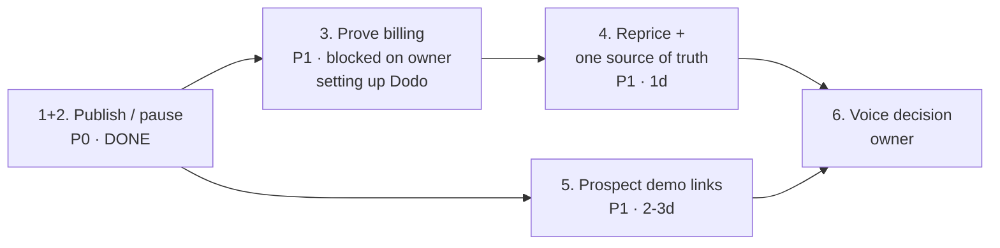

# Backlog

**Snapshot:** 2026-08-05, 12:43 PDT · commit `05f5f0f`

Ordered by what unblocks the most, not by size. Every item states why it
matters, what to touch, and how you know it is done.

Legend — **P0** nothing works without it · **P1** needed to charge or grow ·
**P2** real value, not urgent · **P3** worth doing eventually.

Companion docs: [`START-HERE.md`](START-HERE.md) ·
[`ARCHITECTURE.md`](ARCHITECTURE.md) · [`ENGINEERING-HANDOFF.md`](ENGINEERING-HANDOFF.md)

---

## P0 — the product does not work without these

### 1. ~~Publish an assistant~~ · 2. ~~Unpublish / pause~~ — **done 2026-08-05**

Both shipped in one change. `onSetAssistantStatus(workspaceId, status)` in
`src/actions/settings/index.ts` gates on
`requireWorkspace(workspaceId, 'publishAssistant')` and moves an assistant
between `published` / `paused` / `draft`; `onPublishAssistant`,
`onPauseAssistant` and `onGetAssistantPublishState` sit on top of it.

Decisions taken while implementing, so nobody re-litigates them:

- `publishedAt` is set on **first** publish and preserved across a
  pause/republish. It answers "live since", not "last toggled".
- Publishing with zero indexed chunks is **allowed** and returns a `warning`.
  An agency may reasonably publish ahead of a crawl; blocking it would be a
  guess about their order of work. It is never silent.
- `archived` is not offered here — that is the workspace lifecycle
  (`onDeleteUserDomain`), not an assistant toggle.
- The roster card shows the unpublished state but has no button: a control
  nested inside a card-wide `<Link>` is a misclick trap. Publishing lives on the
  client page and beside the embed snippet, which is where someone is when they
  believe the widget is working.

---

## P1 — required to take money or to grow

### 3. Prove the billing path end to end — **owner-deferred, 2026-08-05**

**Why:** Dodo has never processed a transaction, and the products behind the
configured ids **do not exist on the provider side**. Env vars are not
configuration. The owner is setting Dodo up later; until then treat billing as
greenfield and do not build on it.

Present in `.env.local`: `DODO_API_KEY`, `DODO_WEBHOOK_SECRET`, all six
`DODO_PRODUCT_ID_*` (monthly and yearly). Missing: `DODO_API_BASE`, which falls
back to a hardcoded default.

**Do (once the products exist):** one real checkout in test mode. Confirm
`src/app/api/dodo/webhook/route.ts` verifies its signature, writes a
`Subscription`, records a `BillingEvent` (unique on `provider` +
`externalEventId`), and that `entitlements.ts` then returns the new limits. Set
`DODO_API_BASE` explicitly.

**Done when:** a test purchase moves an org Free → Pro and the workspace limit
actually changes.

**Size:** half a day.

### 4. Reprice, and collapse the duplicate source of truth

**Why:** at $49 for five workspaces, $5k MRR needs 102 customers. A verified
competitor charges **$300** for the same five clients, with a blended ARPU of
$183 — at which $5k needs **27**.

**The trap:** `src/lib/plans.ts` and the `PlanEntitlement` table disagree today
and nothing keeps them in sync. `entitlements.ts` reads **only** the database;
eight other files read **only** `plans.ts`. Change one and the site advertises
limits the product does not enforce.

**Do:** raise the 5-workspace tier toward $149, create matching Dodo products,
and update `plans.ts`, `prisma/seed-plans.mjs` and `pricing-section.tsx`
together. Then remove the duplication — have the pricing page read plans
server-side from the database and delete `plans.ts`.

`plans.ts` also carries dead pre-rebuild concepts (`conversationHistoryDays`,
`getNextResetDate`, `shouldResetCredits`) that nothing enforces.

**Done when:** one source of truth, and the price on the page is the limit
`entitlements.ts` enforces.

**Size:** one day including Dodo product setup.

### 5. Shareable prospect demo links

**Why:** `/demo` builds a working assistant from any URL in ~30 seconds. That
is the strongest sales asset here — an agency can open a call with an assistant
already running on the prospect's own site. Today there is no way to share one.

**Schema is fully ready, nothing writes to it:**

| Seam | Location | State |
|---|---|---|
| `workspaceType: prospect_demo` | `schema.prisma:258` | read-only |
| `shareToken` unique | `schema.prisma:429` | read at `resolve.ts:83`, never written |
| `expiresAt` | schema | unused |
| `maximum_prospect_demos` | `entitlements.ts:153` | enforced, never reached |
| "Demo" badges | `clients-grid.tsx`, `client-switcher.tsx` | render, never populated |

**Note:** [`outreach-demo-funnel-plan.md`](outreach-demo-funnel-plan.md) was
written against the **legacy `Domain` schema**. Its `isDemo` / `demoToken`
design is superseded by the fields above. Read it for intent, not for design.

**Size:** two to three days.

### 6. Decide: chat only, or add voice

**Why:** the closest verified competitor leads with *voice* ("Deliver Voice AI
agents under your brand") and integrates Retell, Vapi and ElevenLabs. The money
in this niche has moved. ChatDock deliberately deferred voice.

The schema was built to accommodate it — `Assistant` is separate from
`AssistantDeployment`, and the channel enums exist. So this is a roadmap
decision, not a rewrite. **But "chat only" should be a choice, not an omission.**

**Do not build voice without an explicit decision from the owner.**

---

## P2 — real value, not blocking

### 7. Finish or remove realtime handoff

`pusher-client.ts` is live in `hooks/chatbot/use-chatbot.ts` and
`hooks/conversation/use-conversation.ts`. `pusher-server.ts` is imported by
**nothing**. The app subscribes to channels that nobody publishes to, so live
takeover cannot work.

Either wire the server half into the conversation actions, or rip out both
halves plus the `pusher` / `pusher-js` dependencies deliberately. Note
`pusher-server.ts` **throws at module load** if the `PUSHER_*` vars are unset.

### 8. ~~Fix the handoff-status inconsistency~~ — **done 2026-08-05**

`actions/settings/index.ts` mapped only `active` back to `live` while
`lib/chat/session.ts:88` treated `accepted` **and** `active` as live. The
session file won: from `accepted` onward a human owns the conversation and the
assistant stays silent, so a dashboard that showed those rooms as not-live was
showing the wrong thing.

### 9. Client-facing login

Today the agency opens the workspace and walks the client through on a review
call. A read-only client view is the most-requested thing the FAQ admits is
missing.

### 10. Export — CSV and API

Conversations and leads are readable in the dashboard only. The FAQ says this
plainly. It is a common procurement question.

### 11. Distributed rate limiting

`widget/resolve.ts` keeps its limiter in process memory. On serverless it does
not hold across instances. Move to Redis or the database.

### 12. Test coverage beyond tenancy

Two suites now, both against a real Postgres:
`tests/security/tenant-isolation.test.ts` (26 tests) and
`tests/security/publish-gate.test.ts` (7 tests — draft/published/paused through
the real `resolveWidgetRequest`, plus who may publish). Still no unit,
integration or E2E anywhere.

`vitest.config.ts` aliases `server-only` to a stub
(`tests/helpers/server-only-stub.ts`) so suites can import the real
`src/lib/**` modules that carry that import, rather than re-implementing their
logic in the test.

Highest-value additions, in order: the rest of `resolveWidgetRequest`'s
rejection chain (origin allow-list, expiry, suspended org, message limit), the
entitlement service, and the knowledge ingest pipeline.

### 13. Supabase RLS

Currently **off**. Isolation is enforced in application code plus the required
tenant argument on `match_knowledge_chunks_scoped`. RLS would be defence in
depth, not a fix for a known hole.

---

## P3 — cleanup and polish

### 14. Delete the two inert dashboard routes

`(dashboard)/experiments` is `notFound()` only. `(dashboard)/domain/[domainId]`
is a redirect shim to `/settings/[domainId]`. Neither earns its place.

### 15. Decide on `public/chat-widget.js`

Zero references anywhere, superseded by `embed.min.js`. But it is still
**served**, so any customer who pasted the old snippet is still loading it.
Confirm no live site references it before deleting. Low risk to keep.

### 16. Reduce the two heaviest routes

`/settings/[domain]` is 76 kB and `/settings/[domain]/advanced` is 83 kB of
first-load JS — several times any other route.

### 17. Landing page length

The homepage is ~15,000 px, about 17 screens, and sections 4–12 share one
card-grid rhythm. Cutting two sections would serve the reader better than
polishing all of them.

### 18. Screenshot / visual regression

Repeated pain this cycle: the hero card rendered empty for a full beat and
survived a fix that was declared done, because nothing catches visual
regressions. Even a handful of Playwright screenshots at fixed animation beats
would have caught it.

---

## Deliberately not doing

| Thing | Why |
|---|---|
| Voice | Backlog by explicit decision — see #6 |
| Fabricated social proof | The landing page says out loud that there are no testimonials yet. Keep it that way until there are real ones. |
| Serving fabricated crawl content | `/demo` treats `isFallback` as an error. It used to answer from invented placeholder pricing about real companies. Never undo this. |

---

## Suggested order

With publishing shipped, the widget works end to end. The next item that is
*not* waiting on the owner is **5, prospect demo links** — it needs no billing
and it is the growth wedge. Repricing (4) is partly doable now: collapsing
`plans.ts` into the database is worth doing before the Dodo products are
created, so the new prices are only entered once.
