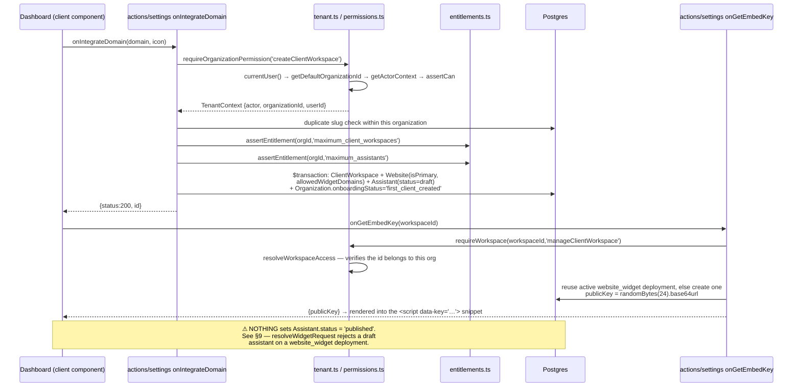

# Engineering handoff

Written 2026-08-05 by reading the code, not the docs. Where a doc and the code
disagreed, the code won and the disagreement is recorded here.

> **New here? Read [`START-HERE.md`](START-HERE.md) first.** It is the dated
> entry point: where the product actually stands, the mind map, and the next
> five steps. This file is the depth behind it.
>
> Updated 2026-08-05 (later the same day): the publish path shipped — §9.1 is
> closed — and Dodo is confirmed **not** configured, deferred by the owner.

Companion documents — read them, do not re-derive them:

| Document | What it holds |
|---|---|
| [`START-HERE.md`](START-HERE.md) | **Entry point.** Dated snapshot, mind map, next five steps, market intelligence, corrections log. |
| [`ARCHITECTURE.md`](ARCHITECTURE.md) | Current technical architecture: all 32 models grouped, every page, every API route, every server action, security-critical libs. |
| [`BACKLOG.md`](BACKLOG.md) | Everything worth doing, ordered P0–P3, with why / what to touch / done-when. |
| [`docs/database-architecture.md`](database-architecture.md) | The **legacy** 16-model schema and why it was replaced. Historical. |
| [`docs/rebuild/STATUS.md`](rebuild/STATUS.md) | Phase tracker, deliverable list, live-verification results, backlog. |
| [`docs/rebuild/authorization-and-entitlements.md`](rebuild/authorization-and-entitlements.md) | Full permission and entitlement matrices as tables. |
| [`docs/rebuild/dashboard-redesign.md`](rebuild/dashboard-redesign.md) | Dashboard UI audit and information architecture. |
| [`docs/homepage-redesign.md`](homepage-redesign.md) | Marketing-site design direction. |
| [`docs/outreach-demo-funnel-plan.md`](outreach-demo-funnel-plan.md) | Prospect-demo plan. **Written against the legacy `Domain` schema — its `isDemo` / `demoToken` design is superseded by `ClientWorkspace.workspaceType = prospect_demo` and `AssistantDeployment.shareToken`.** |
| [`PRODUCT-OWNER-QUESTIONS.md`](../PRODUCT-OWNER-QUESTIONS.md) | Product decisions with the owner's answers. |

There is no `CLAUDE.md` in this repo.

---

## 1. Orientation

ChatDock sells to **agencies** — web, SEO and lead-gen shops — who install a
branded "AI receptionist" chat widget on their own clients' websites. The widget
answers from content crawled off that client's site, captures leads (email *or*
phone), and collects booking requests. The agency is the paying customer; the
agency's clients are the ones whose visitors actually chat.

Direct businesses are supported as a degenerate case
(`Organization.organizationType = direct_business`, one auto-created workspace).

### The hierarchy — the one thing to internalise

```mermaid
graph TD
    U[User<br/>a human, authed by Clerk] -->|OrganizationMembership<br/>owner/admin/manager/member/analyst/billing| O
    O[Organization<br/>the PAYING TENANT<br/>billing, branding, entitlements] --> CW[ClientWorkspace<br/>THE ISOLATION BOUNDARY<br/>one agency client]
    U -.->|ClientWorkspaceMembership<br/>agency_manager/agency_member/<br/>client_admin/client_member/client_viewer| CW
    CW --> W[Website<br/>prod, staging, campaign page]
    CW --> A[Assistant<br/>configuration only]
    CW --> KS[KnowledgeSource → KnowledgeDocument → KnowledgeChunk]
    CW --> CONV[Visitor / Conversation / Message / Lead / BookingRequest]
    A --> AD[AssistantDeployment<br/>website_widget | preview | shareable_demo<br/>carries publicKey / shareToken]
    W --> AD
    A -.->|AssistantKnowledgeSource| KS
    O --> S[Subscription → Plan → PlanEntitlement]
    O --> UE[UsageEvent — append-only meter]
```

- **`Organization` is the tenant that pays.** Billing, white-labelling and
  entitlements live here. Never on a `User`.
- **`ClientWorkspace` is the isolation boundary.** Every row a request can read
  carries `clientWorkspaceId` **directly**, even when it is reachable via a
  parent. That denormalisation is deliberate (`prisma/schema.prisma:10-16`): it
  lets every query filter the tenant in its own `WHERE` instead of trusting a
  join.
- **`Assistant` belongs to the workspace, not to a website.** One assistant can
  serve several sites, and a future voice channel reuses it untouched.
- **`AssistantDeployment` is where and how it is reachable.** Splitting it from
  `Assistant` is what makes preview, prospect demos and future channels possible
  without duplicating configuration. Its `publicKey` is the credential the embed
  script carries — rotatable, revocable, never an internal row id.

Cascade rule (`prisma/schema.prisma:18-21`): memberships cascade from both ends;
everything *authored* by a user uses `SetNull` so history survives offboarding;
tenant roots soft-delete via `deletedAt`. Deleting a person must never delete a
business.

---

## 2. Repo map

| Path | What belongs there |
|---|---|
| `src/actions/` | **Server actions** (`'use server'`). One `index.ts` per domain: `appointment`, `auth`, `bot`, `clients`, `conversation`, `dodo`, `firecrawl`, `landing`, `mail`, `payments`, `settings`. Every one calls into `src/lib/tenant.ts` for authorization first. |
| `src/app/(main)/` | All pages. `(dashboard)` route group = authed app; `auth`, `blogs`, `demo`, `preview`, `portal` are public (see `src/middleware.ts`). |
| `src/app/api/` | **Route handlers.** Five of them: `bot/stream`, `bot/preview/stream`, `dodo/webhook`, `upload`, `health/rag`. |
| `src/lib/` | Server-side services and shared helpers. The security-critical files are `tenant.ts`, `permissions.ts`, `entitlements.ts`, `widget/resolve.ts`, `vector-search.ts`. Several are `import 'server-only'`. |
| `src/components/` | React components, 129 files, grouped by feature (`landing/`, `clients/`, `dashboard/`, `settings/`, `forms/`, `sidebar/`, …) plus `ui/` for shadcn primitives. |
| `src/hooks/` | Client-side hooks per feature (`chatbot`, `conversation`, `firecrawl`, `settings`, `billing`, `portal`, `sign-in`, `sign-up`, `sidebar`). |
| `src/context/` | React context providers (chat, auth, sidebar, theme). |
| `src/schemas/` | Zod schemas for forms — `auth`, `conversation`, `settings`. |
| `src/constants/` | Static copy and config: `faq.ts`, `landing-page.ts`, `menu.tsx`, `forms.ts`, `integrations.ts`, `timeslots.ts`. |
| `src/icons/` | Hand-written icon components. |
| `src/types/` | Ambient type declarations (currently only `pdf-parse-fork.d.ts`). |
| `src/middleware.ts` | Clerk middleware + the public-route allow-list. Anything not matched is `auth.protect()`ed. |

### `src/actions` vs `src/app/api` — when to use which

**Use a server action** when the caller is this app's own authenticated UI. The
Clerk session is already in scope, `requireTenantContext()` / `requireWorkspace()`
work directly, and there is no URL to secure. Actions return plain objects with a
`status` field and swallow `AuthorizationError` into `403` /
`EntitlementError` into `402` (see `src/actions/settings/index.ts:152-157`).
This is the default and covers the great majority of the app.

**Use a route handler** only when something *outside* the app must call you:

- an unauthenticated third party — the widget on a client's website
  (`api/bot/stream`), the marketing sandbox (`api/bot/preview/stream`);
- a webhook — `api/dodo/webhook`, which verifies a Standard Webhooks signature
  before parsing;
- a response shape actions cannot produce — SSE streaming (`api/bot/stream`
  returns a `ReadableStream` of `text/event-stream`);
- a secret proxy — `api/upload` exists purely so `KIE_API_KEY` never reaches a
  browser;
- an ops probe — `api/health/rag`.

Route handlers on a public path do **not** get tenant context from Clerk. They
must derive it themselves; for the widget that is
`src/lib/widget/resolve.ts:resolveWidgetRequest`.

---

## 3. Request lifecycle

### (a) Visitor message on a deployed widget → grounded answer

Entry: `POST /api/bot/stream` — `src/app/api/bot/stream/route.ts:POST`.

```mermaid
sequenceDiagram
    participant B as Browser (embed.min.js iframe)
    participant R as api/bot/stream POST
    participant WR as widget/resolve.ts
    participant ENT as entitlements.ts
    participant S as chat/session.ts
    participant V as vector-search.ts
    participant PG as Postgres (pgvector)
    participant LLM as Gemini via ai-models.ts

    B->>R: {deploymentKey, message, anonymousId, sourceUrl}
    R->>R: checkRateLimit(`key:anonymousId`) — 20/60s, in-process
    R->>WR: resolveWidgetRequest(key, Origin|Referer)
    WR->>PG: AssistantDeployment where publicKey=key OR shareToken=key
    WR->>WR: deployment active? unexpired? assistant published?<br/>workspace/org alive? origin allow-listed?
    WR->>ENT: checkEntitlement(orgId,'monthly_messages',1)
    ENT-->>WR: allowed?
    WR-->>R: WidgetContext {deploymentId, assistantId,<br/>clientWorkspaceId, organizationId, assistant{…}}
    R->>S: resolveSession() — Visitor.upsert, find/create active Conversation
    R->>S: appendVisitorMessage()
    Note over R: if session.isLive (handoffStatus accepted/active) → return, stay silent
    R->>S: captureLead() if email or phone found in the message text
    R->>V: searchKnowledgeBaseMultiQuery(message, {clientWorkspaceId, assistantId})
    V->>V: expandQuery → generateEmbeddings (OpenAI 1536d)
    V->>PG: SET LOCAL hnsw.ef_search=100;<br/>match_knowledge_chunks_scoped(workspaceId, vec, …)
    PG-->>V: chunks (tenant-filtered IN SQL)
    V->>V: dedupe → rerankChunks (Jina, optional)
    V-->>R: SearchResult[]
    R->>R: formatResultsForPrompt() — fenced <reference_material>, labelled untrusted
    R->>R: buildSystemPrompt() — promptBuilder.ts
    R->>LLM: streamText(getModel(modelName), [system, …history, user])
    LLM-->>B: SSE `data: {"content": "…"}` per chunk, then `data: [DONE]`
    R->>S: appendAssistantMessage() — Message + MessageCitation[] + recordUsage()
```

Things worth knowing about this path:

- It is the **only unauthenticated write path in the product**.
- The rate limiter runs *before* any database call, resolution runs before any
  model call, and the entitlement check runs before token spend.
- Retrieved text is fenced as untrusted in
  `src/lib/vector-search.ts:formatResultsForPrompt` and placed in the system
  message *as a fenced block* by `buildSystemPrompt`. Never concatenate crawled
  content into `Assistant.systemInstructions`.
- Retrieval failure returns `[]` rather than throwing — a degraded answer beats
  a broken widget on a client's site.
- The partial answer is persisted even when the stream errors
  (`route.ts:229-244`).

### (b) Agency creates a client workspace and publishes an assistant

Entry: `onIntegrateDomain` — `src/actions/settings/index.ts:87`.



Knowledge ingestion is a separate flow: `src/actions/firecrawl/index.ts`
(`onScrapeWebsiteForDomain`, `onDiscoverTrainingSources`,
`onScrapeSelectedSources`, `onUploadPDFKnowledgeBase`, `onTrainChatbot`) driving
`src/lib/knowledge/ingest.ts` (`createSource` → `upsertDocument` →
chunk/embed → `KnowledgeChunk`). `upsertDocument` returns `changed: false` when
the SHA-256 of the extracted text is unchanged, which is what makes re-crawls
cheap.

---

## 4. Data model

`prisma/schema.prisma` — **32 models, 42 enums** (verified by count; STATUS.md
says "54 enums", which is wrong).

| Concern | Models |
|---|---|
| Identity | `User`, `OrganizationMembership`, `ClientWorkspaceMembership` |
| Tenant | `Organization`, `ClientWorkspace` |
| Delivery surface | `Website`, `Assistant`, `AssistantDeployment`, `DeploymentEngagementEvent` |
| Knowledge | `KnowledgeSource`, `KnowledgeDocument`, `KnowledgeChunk`, `AssistantKnowledgeSource` |
| Ingestion jobs | `CrawlJob`, `IndexingJob` |
| Conversations | `Visitor`, `Conversation`, `Message`, `MessageCitation` |
| Leads | `Lead`, `LeadFieldDefinition`, `LeadFieldValue` |
| Bookings & catalogue | `BookingRequest`, `ServiceItem` |
| Billing | `Plan`, `Subscription`, `PlanEntitlement`, `OrganizationEntitlement`, `UsageEvent`, `BillingEvent` |
| Ops | `Integration`, `AuditLog` |

### Invariants a newcomer will get wrong

All of the following were checked against `prisma/schema.prisma` line by line.

1. **`Lead` has no unique constraint on `email`.** ✅ Correct. `email`, `phone`
   and `name` are all nullable; the only indexes are
   `[clientWorkspaceId, email]` and `[clientWorkspaceId, phone]` — non-unique.
   Phone-only leads are the common shape for home-services clients. Dedupe is an
   *application* decision, implemented in
   `src/lib/chat/session.ts:captureLead` (match on visitor, then email, then
   phone). Do not "fix" this with a unique index.
2. **`BookingRequest.status` defaults to `requested`.** ✅ Correct
   (`schema.prisma:1051`). The model is named `BookingRequest`, not `Booking`,
   on purpose: with no calendar integration ChatDock only ever collects a
   *requested* time. `confirmedStartAt` / `confirmedEndAt` exist and are null
   until something confirms them — and nothing does today. No UI may present
   `requested` as confirmed.
3. **`UsageEvent.idempotencyKey` is `@unique` and the table is append-only.**
   ✅ Correct. `recordUsage` swallows Prisma `P2002` and treats it as success
   (`src/lib/entitlements.ts:325-335`). Never `update` or `delete` a
   `UsageEvent` — it is the billing source of truth, and operational tables are
   deliberately not counted as a proxy for usage.
4. **`BillingEvent` is `@@unique([provider, externalEventId])`.** ✅ Correct.
   `beginBillingEvent` inserts first and lets the database reject the replay, so
   there is no check-then-act race
   (`src/lib/billing/subscription.ts:157-184`).
5. **`Conversation.handoffStatus` is an enum that replaced a boolean.**
   ✅ Correct. `HandoffStatus` has six values
   (`none | requested | accepted | active | completed | cancelled`) and replaced
   the ambiguous `ChatRoom.live`. Legacy-shaped action responses still project it
   back down to a boolean, but as of 2026-08-05 they agree: both
   `src/actions/settings/index.ts` and `src/lib/chat/session.ts:88` treat
   `accepted` **and** `active` as live. The session file is the behavioural
   truth — a human has taken the conversation from `accepted` onward, and the
   assistant must stay silent. Any new projection must match it.

Additional invariants worth the same weight:

6. **`KnowledgeChunk.embedding` is `Unsupported("vector(1536)")`.** Prisma
   cannot read or write it. All vector work is raw SQL. The unique key is
   `[knowledgeDocumentId, chunkIndex, embeddingVersion]` — bump
   `embeddingVersion` to build a replacement index while the live one stays
   queryable.
7. **Money is always integer minor units + ISO currency.** `priceAmountMinor`,
   `monthlyPriceMinor`, `estimatedCostMinor`. Never a float, never
   currency-less.
8. **`PlanEntitlement.limitValue` / `OrganizationEntitlement.limitValue` are
   `BigInt?`. `null` means unlimited; booleans are stored as 0/1.** A key that
   is *absent* from the plan resolves to `0n` (denied), not unlimited —
   `src/lib/entitlements.ts:104`.
9. **`ClientWorkspace.expiresAt` / `convertedAt` are prospect-demo fields.**
   Null for real clients. `workspaceType = prospect_demo` workspaces are
   excluded from `maximum_client_workspaces` and counted against
   `maximum_prospect_demos` instead.

---

## 5. Multi-tenancy and authorization

### The chain

`src/lib/tenant.ts` is the only place a request becomes "who is acting, in which
organization, on which client". Its contract: **every exported helper returns
verified ids; pass those into queries, never the ones that arrived in the
request.**

- `getTenantContext(organizationId?)` — Clerk `currentUser()` →
  `getDefaultOrganizationId` → `getActorContext`. Returns `null` when
  unauthenticated or without an active membership. Callers must treat `null` as
  denied.
- `requireTenantContext()` — same, but throws `AuthorizationError`.
- `requireWorkspace(clientWorkspaceId, permission)` — verifies a
  client-supplied workspace id **and** a permission in one call, returning the
  verified ids.
- `requireOrganizationPermission(permission)` — org-level gate (billing, team,
  org settings).
- `accessibleWorkspaceIds(ctx)` — the canonical way to scope a cross-client
  query: `where: { clientWorkspaceId: { in: ids } }`.
- `ensureUserAndOrganization(...)` — idempotent first-sign-in provisioning, in a
  transaction: `User` → `Organization` → owner membership → FREE `Subscription`
  (+ a single workspace for `direct_business`).

### Roles

`src/lib/permissions.ts` holds two matrices — `ORG_ROLE_PERMISSIONS` (6 org
roles) and `WORKSPACE_ROLE_PERMISSIONS` (5 workspace roles) — over 22
`Permission` strings. Full tables live in
[`docs/rebuild/authorization-and-entitlements.md`](rebuild/authorization-and-entitlements.md).

`resolveWorkspaceAccess(actor, clientWorkspaceId)` is the function that stops a
foreign id being honoured. It queries `ClientWorkspace` with
`organizationId: actor.organizationId` in the `WHERE` — without that clause any
valid uuid would resolve.

Then:

- **owner/admin** have `hasImplicitWorkspaceAccess` and reach every workspace in
  their org with no `ClientWorkspaceMembership` row; they get their full org
  permission set.
- **everyone else** needs an explicit membership row, and their effective
  permissions are the **intersection** of the org-role set and the
  workspace-role set (`permissions.ts:271-274`). A workspace assignment can
  never grant more than the org role already allows — otherwise assignment is a
  privilege-escalation path.
- A **suspended** organization drops to read-only: only `view*` and
  `manageBilling` survive (`permissions.ts:200-202`).

### pgvector: `match_knowledge_chunks_scoped`

Defined in
`prisma/migrations/20260804000100_pgvector_index_and_search/migration.sql`.

```
match_knowledge_chunks_scoped(
  p_client_workspace_id uuid,          -- REQUIRED. No default, by design.
  p_query_embedding     vector(1536),
  p_match_count         int   DEFAULT 8,
  p_match_threshold     float DEFAULT 0.0,
  p_assistant_id        uuid  DEFAULT NULL,
  p_embedding_version   int   DEFAULT 1
)
```

- `p_client_workspace_id` is the **first positional argument and has no
  default**, so the function is impossible to call unscoped. The predicate
  `kc."clientWorkspaceId" = p_client_workspace_id` is applied *inside* the
  query, first.
- `p_assistant_id`, when supplied, further narrows to sources with an enabled
  `AssistantKnowledgeSource` row — one workspace can hold shared knowledge while
  assistants use different subsets.
- `SECURITY INVOKER`, not `DEFINER` — elevating here would silently bypass any
  future row-level policy.
- Hard `LIMIT LEAST(GREATEST(p_match_count,1),100)` as a cost guard.
- The legacy unscoped `match_knowledge_chunks` is explicitly `DROP`ped in the
  same migration.
- Callers go through `src/lib/vector-search.ts:runScopedSearch`, which wraps the
  call in a transaction and raises `SET LOCAL hnsw.ef_search = 100` — HNSW
  filters *after* the graph walk, so a selective tenant predicate otherwise
  under-returns at the default `ef_search = 40`.

### What the security suites prove

`tests/security/publish-gate.test.ts` covers the publish transition end to end:
a real `AssistantDeployment` row with a `publicKey`, driven through
`draft → published → paused` and resolved with the real
`resolveWidgetRequest` each time. It asserts that a draft 403s with
`assistant_unpublished`, that publishing makes the *same key* resolve to the
right assistant/workspace/organization, that pausing takes it offline with the
client's rows intact, and that an unknown key is a 404 rather than a
distinguishable error. It also pins the permission side: an owner may publish,
a scoped `agency_member` may edit but not publish, and a client-side user has
no organization context at all.

### What `tests/security/tenant-isolation.test.ts` proves

Vitest against a **real Postgres** (`npm test` loads `.env.local`; the suite
takes ~150s because every query is a round trip to remote Supabase). Six
groups:

1. Org A cannot reach Org B — no actor context cross-org, a valid foreign
   workspace id does not resolve, a forged `organizationId` is denied, listings
   never leak.
2. A scoped member reaches only assigned workspaces; owners keep implicit
   access.
3. Client-side and `billing`/`analyst` roles cannot read what they must not;
   a workspace role cannot escalate past the org role.
4. Vector isolation — scoped search never returns another tenant's chunks;
   assistant source selection is honoured; disabling a source removes it;
   the legacy unscoped function is gone from `information_schema.routines`.
5. Entitlements — usage attributed per org, no-subscription falls back to FREE
   not unlimited, prospect demos excluded from the workspace count,
   `recordUsage` idempotent.
6. Data reads are tenant-scoped, including a scoped member's export.

**The non-vacuity assertion** (`tenant-isolation.test.ts:146-171`) is the one to
understand. Workspaces A1 and B1 are seeded with **byte-identical chunk text**,
so their embeddings — and therefore their distances to the query — are identical.
One test runs a deliberately *unscoped* raw query, asserts that it returns rows
from **both** workspaces, and asserts
`max(similarity) - min(similarity) < 1e-6`. That proves the fixture is genuinely
adversarial: scoping is the *only* thing that can separate the two. Without this
guard every isolation test below it could pass for the wrong reason (e.g. if the
fixture data had drifted apart) and nobody would know.

### Supabase RLS

**Off.** No `ENABLE ROW LEVEL SECURITY` and no `CREATE POLICY` exists anywhere in
`prisma/` or `scripts/`. Isolation today is entirely application-level plus the
required argument on the SQL function, and is proven only by the test suite.
Row-level policies are wanted as defence in depth and are listed as an open item
in `docs/rebuild/STATUS.md`.

---

## 6. Entitlements and billing

`src/lib/entitlements.ts` is the single resolution path:

```
PlanEntitlement (via Subscription → Plan)  →  OrganizationEntitlement override  →  answer
```

- `getEntitlements(organizationId)` reads the subscription's plan entitlements,
  then overlays unexpired `OrganizationEntitlement` rows on top. Overrides win —
  that is how bespoke deals and grandfathering work without forking a plan.
- No subscription row ⇒ falls back to the **FREE** plan, never to unlimited.
- `getLimit` returns `0n` for a key absent from the plan — denied, not
  unlimited.

**How a limit is checked.** Two measurement styles:

- `COUNT_BASED` — counted from rows that exist right now:
  `maximum_client_workspaces` (excludes `prospect_demo`),
  `maximum_prospect_demos`, `maximum_assistants`, `maximum_team_members`,
  `maximum_client_users`.
- `USAGE_BASED` — summed from the append-only `UsageEvent` over the billing
  period: `monthly_messages`, `monthly_crawl_pages`, `storage_bytes`
  (running total, not per-period).

The period comes from `Subscription.currentPeriodStart/End`, written by the Dodo
webhook; with no subscription it falls back to the calendar month
(`getBillingPeriod`). Callers use `checkEntitlement(orgId, key, increment)` for a
soft read or `assertEntitlement(...)` to throw `EntitlementError`, and
`hasFeature(...)` for boolean flags. Actions map `EntitlementError → 402`.

Real call sites: `src/lib/widget/resolve.ts:203` (before any model call),
`src/actions/settings/index.ts:103-104`, `src/lib/knowledge/ingest.ts:66`.

Billing writes go through `src/lib/billing/subscription.ts`
(`applyPlanToOrganization`, `beginBillingEvent`, `finishBillingEvent`,
`organizationForExternalId`) and `src/app/api/dodo/webhook/route.ts`, which
verifies the Standard Webhooks signature before parsing, claims the event in
`BillingEvent` before doing anything, returns 200 on a duplicate and 400 on
failure so the provider retries safely. Note: `payment.failed` /
`subscription.on_hold` deliberately keep the customer on the paid plan as
`past_due` rather than taking client assistants offline over one retryable
charge. **Dodo is not actually configured** — the env vars are set but no
products exist on the provider side, so the `DODO_PRODUCT_ID_*` values point at
nothing. Confirmed with the owner on 2026-08-05; setting it up is deferred.

### ⚠ Known duplicate source of truth

There are two plan-limit definitions:

| | `PlanEntitlement` table | `src/lib/plans.ts` |
|---|---|---|
| Read by | `src/lib/entitlements.ts` only | 10 files |
| Effect | **Enforced.** Gates workspace creation, assistant creation, ingestion, and every widget message. | **Advertised.** Pricing page, margin calculator, settings page, payment forms. |

**The database wins today**, because `entitlements.ts` never reads `plans.ts` and
nothing that gates an action reads `plans.ts`. The trap: `plans.ts` is what a
prospect *sees*, and nothing keeps the two in step. STATUS.md records they were
verified identical on 2026-08-05 — the first divergence makes the pricing page
lie while the product silently enforces something else. `plans.ts` is also
carrying dead concepts (`conversationHistoryDays`, `getNextResetDate`,
`shouldResetCredits`) from the pre-rebuild credit model that nothing enforces.

Intended fix: have the pricing page read plans server-side from the database,
then delete `plans.ts`.

Consumers of `plans.ts`, for when you do that (8, verified against the tree):
`src/app/(main)/(dashboard)/settings/page.tsx`,
`src/components/forms/settings/form.tsx`,
`src/components/forms/settings/subscription-form.tsx`,
`src/components/landing/margin-calculator.tsx`,
`src/components/landing/pricing-section.tsx`,
`src/components/settings/payment-form.tsx`,
`src/components/settings/payment-success.tsx`,
`src/components/settings/stripe-elements.tsx`.

---

## 7. Environment variables

Derived by grepping `process.env.*` across `src/`, `scripts/`, `prisma/`,
`tests/` and `next.config.mjs`, cross-referenced with `.env.example`. Names only.
`.env` / `.env.local` were not opened.

### Required — the app is broken without them

| Name | What breaks |
|---|---|
| `DATABASE_URL` | Everything. Pooled Prisma connection. |
| `DIRECT_URL` | `prisma migrate` (and therefore `npm run build`). |
| `NEXT_PUBLIC_CLERK_PUBLISHABLE_KEY` | Clerk client. No sign-in. |
| `CLERK_SECRET_KEY` | Clerk server. Read by the SDK, not by our code — it appears in `.env.example` but not in any `process.env` grep hit. Middleware and `currentUser()` fail without it. |
| `OPENAI_API_KEY` | Embeddings (`text-embedding-3-small`). No ingestion, no retrieval. Also gates query expansion. |
| `GOOGLE_GENERATIVE_AI_API_KEY` **or** `GEMINI_API_KEY` | The default assistant model `gemini-2.5-flash-lite`. Both are read — see gotcha #1. |
| `NEXT_PUBLIC_APP_URL` | Portal/booking links in prompts, the self-widget's script origin, sitemap/metadata. Falls back to `http://localhost:3000` in `SelfWidget` only. |

### Effectively required for a working feature

| Name | Feature that dies |
|---|---|
| `FIRECRAWL_API_KEY` | Website crawling / knowledge ingestion from URLs. |
| `PUSHER_APP_ID`, `PUSHER_KEY`, `PUSHER_SECRET`, `PUSHER_CLUSTER` | `src/lib/pusher-server.ts` **throws at import time** if any is missing. Currently harmless because nothing imports it (§9). |
| `NEXT_PUBLIC_PUSHER_APP_KEY`, `NEXT_PUBLIC_PUSHER_APP_CLUSTER` | `pusher-client.ts` — the subscribe side of realtime. |
| `DODO_WEBHOOK_SECRET` | Webhook signature verification. Falls back to a dummy string, so every real delivery fails verification. |
| `DODO_API_KEY`, `NEXT_PUBLIC_DODO_API_URL`, `DODO_PRODUCT_ID_{STARTER,PRO,BUSINESS}[_YEARLY]` | Checkout link creation. |
| `KIE_API_KEY` | `/api/upload` throws — chatbot image uploads. |
| `NODE_MAILER_EMAIL`, `NODE_MAILER_GMAIL_APP_PASSWORD` | Outbound email (`src/actions/mail`, `src/actions/mailer`). |
| `NEXT_PUBLIC_CHATDOCK_WIDGET_KEY` | The marketing site renders **no widget of its own** — deliberate: better than a broken one. |

### Optional / tuning

| Name | Effect if unset |
|---|---|
| `ANTHROPIC_API_KEY` | Claude models unusable; not the default. |
| `JINA_API_KEY` | Reranking silently disabled; retrieval falls back to vector order. |
| `FIRECRAWL_API_URL` | Defaults to the hosted endpoint. |
| `FIRECRAWL_SCRAPE_MAX_RETRIES`, `FIRECRAWL_SCRAPE_BASE_DELAY_MS`, `FIRECRAWL_MAP_MAX_RETRIES`, `FIRECRAWL_MAP_BASE_DELAY_MS` | Retry/backoff defaults. |
| `NEXT_PUBLIC_HERO_RIVE_SRC` | Homepage hero animation source. |
| `NEXT_PUBLIC_CLERK_SIGN_IN_URL`, `NEXT_PUBLIC_CLERK_SIGN_UP_URL`, `..._FALLBACK_REDIRECT_URL`, `NEXT_PUBLIC_CLERK_OAUTH_CALLBACK_URL` | Clerk routing defaults. |
| `ALLOW_SEED` | Guard on `prisma/seed.mjs`; must be `1` to run the dev seed. |
| `NODE_ENV` | Gates `devLog` / `devError`. |

### Present in `.env.example` but not read by any code

`NEXT_PUBLIC_SUPABASE_URL`, `NEXT_PUBLIC_SUPABASE_ANON_KEY`,
`NEXT_PUBLIC_RETURN_URL`, `FIRECRAWL_SPEED_MODE`,
`FIRECRAWL_INTER_URL_DELAY_MS`. Note `.env.example` lists
`GOOGLE_GENERATIVE_AI_API_KEY` twice.

---

## 8. Gotchas

1. **The Gemini key is read from two names.**
   `src/lib/ai-models.ts:21-26` does
   `process.env.GEMINI_API_KEY || process.env.GOOGLE_GENERATIVE_AI_API_KEY ||
   'build_time_dummy_gemini_key'`. The deployed environment sets the *latter*;
   the code originally only read the former, silently fell through to the dummy
   key, and every Gemini call failed with `API_KEY_INVALID` — which broke the
   default chat path outright, since `gemini-2.5-flash-lite` is the default
   assistant model. If you refactor provider setup, keep both names.
2. **The marketing widget lives outside React and needs explicit teardown.**
   `public/embed.min.js` appends its iframe (`iframe.bml-chat-frame`) straight to
   `document.body` and sets a `window.__bml_embed_loaded__` guard so it never
   boots twice. `next/script` therefore cannot manage it: a client-side
   navigation unmounts the component but leaves the widget on screen (the sales
   assistant following a signed-in customer into their dashboard), and once torn
   down it never came back. `src/components/landing/self-widget.tsx` owns the
   `<script>` element itself and on unmount calls `window.bml('destroy')`, clears
   the guard, removes the tag **and** removes any leftover
   `iframe.bml-chat-frame`. All four steps are required.
3. **`npm run build` runs migrations against the live database.** The script is
   `prisma generate && prisma migrate deploy && next build`. For a compile-only
   check use `npx next build`, which skips both Prisma steps. Do not run
   `npm run build` casually, and never from a branch whose `prisma/migrations/`
   you are still editing.
4. **Do not run a build while the dev server is running.** Both write `.next/`,
   and the interleaved writes leave a corrupted build directory whose symptoms
   (missing chunks, stale manifests) look like source bugs. Stop `next dev`
   first; if it already happened, delete `.next/` and restart.
   *UNVERIFIED: this is a widely-reported Next.js behaviour and is consistent
   with this repo's setup, but I found no incident record for it in this
   repository.*
5. **`public/images/logo.svg` renders blank inside an ``.** It is an
   `<svg>` whose only child is `<image href="/images/chatdock-mark.png">`, and
   browsers refuse to resolve external references inside an `` — the file
   loads (512×512, `complete === true`) and paints nothing. Commit `7145fe6`
   fixed the demo header by switching to `/images/chatdock-mark.png` directly.
   *Correction to the brief: the path is `public/images/logo.svg`; there is no
   `public/logo.svg`.* The only remaining reference is
   `src/app/(main)/layout.tsx` (favicon + JSON-LD), where it is fine because
   neither is an ``. The one place that did render it blank,
   `src/components/sidebar/maximized-menu.tsx`, was dead code and has been
   deleted. Reach for `/images/chatdock-mark.png` in any new ``.
6. **`match_knowledge_chunks_scoped` under-returns without `ef_search`.** HNSW
   applies the tenant filter *after* the graph walk. `runScopedSearch` sets
   `SET LOCAL hnsw.ef_search = 100` per transaction. Any new caller that bypasses
   `runScopedSearch` will quietly get fewer chunks than it asked for.
7. **The rate limiter is process-local.** `src/lib/widget/resolve.ts` keeps
   buckets in a module-level `Map`. On serverless it does not hold across
   instances. It stops casual abuse of the public LLM endpoint, not a
   distributed attack.
8. **The widget origin allow-list fails *open* when empty.**
   `resolve.ts:191` — `if (allowed.size > 0 && requestHost && !allowed.has(...))`.
   An unconfigured deployment accepts any origin, deliberately, so that shipping
   the check did not break every existing install. A deployment created by
   `onGetEmbedKey` does get a populated list.
9. **Every pre-rebuild embed on a client site is dead.** The old snippets carried
   ids of rows the rebuild removed. Each live client needs the new snippet from
   Settings → Code snippet.
10. **Legacy naming is everywhere in the UI layer.** Routes still use
    `[domainId]` / `[domain]`, actions are still called `onIntegrateDomain` and
    `onGetAllAccountDomains`, and several return "legacy shapes"
    (`toLegacyChatBot`, `customer`, `chatRoom.live`). The underlying rows are
    `ClientWorkspace` / `Assistant` / `Lead` / `Conversation`. Read the action
    body before trusting a name.
11. **`src/lib/pusher-server.ts` throws at import time** if any of the four
    `PUSHER_*` vars is missing. Importing it in a new file will take down
    whatever route imports it, on any environment that has not set them.

---

## 9. Known gaps and half-built features

1. ~~**There is no way to publish an assistant.**~~ **Fixed 2026-08-05.**
   `onSetAssistantStatus` in `src/actions/settings/index.ts` asserts
   `publishAssistant` via `requireWorkspace` and writes `status` +
   `publishedAt`; `onPublishAssistant` / `onPauseAssistant` wrap it and
   `onGetAssistantPublishState` reads it back for surfaces that hold only a
   workspace id. `publishedAt` is first-publish-only, so it survives a
   pause/republish. UI: `src/components/clients/publish-toggle.tsx`, used on the
   client overview and beside the embed snippet. A new assistant is still
   created as `draft` on purpose — `onIntegrateDomain` cannot know the crawl has
   run, and `src/lib/widget/resolve.ts:148` still returns
   `403 assistant_unpublished` until someone publishes deliberately.
2. **Realtime is half-wired.** `src/lib/pusher-client.ts` is imported by
   `src/hooks/chatbot/use-chatbot.ts` and `src/hooks/conversation/use-conversation.ts`,
   which subscribe to channels. `src/lib/pusher-server.ts` is imported by
   **nothing** (the only textual hit is a comment in `src/lib/utils.ts`). Nothing
   ever triggers a Pusher event, and `onRealTimeChat`
   (`src/actions/conversation/index.ts:167`) is a pure pass-through that returns
   its arguments. Human takeover therefore has a working data model
   (`handoffStatus`, `role: human_agent`, `onOwnerSendMessage`) and no live
   delivery — the visitor's widget will not see an agent's reply without a
   refresh.
3. **Voice is backlog. Do not build it.** The schema carries seams only —
   `future_voice_inbound` / `future_voice_outbound` on `AssistantType`,
   `future_voice` on `DeploymentType` / `ConversationChannel` / `LeadSource` /
   `IntegrationType`, `future_voice_minute` / `future_transcription_second` /
   `future_tts_character` on `UsageEventType`, `future_voice_minutes` on
   `EntitlementKey`, `future_transcript` on `MessageType`. No voice tables, no
   audio storage, no code. These exist because adding an enum value later is
   cheap and restructuring a table is not. Adding a voice feature now is
   explicitly out of scope.
4. **The prospect demo funnel has seams but no flows.** Present:
   `WorkspaceType.prospect_demo`, `ClientWorkspace.expiresAt` / `convertedAt`,
   `DeploymentType.shareable_demo`, `AssistantDeployment.shareToken` (unique),
   the `DeploymentEngagementEvent` model, `maximum_prospect_demos` entitlement,
   and `resolveWidgetRequest` already accepting a `shareToken` and honouring
   `demo_expired`. Missing: anything that *creates* a prospect demo, issues a
   share token, sends the link, records a `DeploymentEngagementEvent` (no writer
   exists), or converts a demo to an active client. `docs/outreach-demo-funnel-plan.md`
   is the plan but was written against the old `Domain`/`isDemo` schema and its
   data design no longer applies.
5. **Client-facing login does not exist.** `WorkspaceRole` defines
   `client_admin` / `client_member` / `client_viewer` and `permissions.ts` scopes
   them correctly, but there is no invite flow, no client-side sign-up, and no
   client-scoped UI. `/portal/[domainid]` is the *lead*-facing booking/payment
   surface, not a client login. `src/constants/faq.ts:76` says so publicly.
6. **No CSV or API export.** `exportConversations` exists as a permission and is
   tested, but nothing implements an export. There is no `text/csv` response
   anywhere in `src/`. `EntitlementKey.api_access` exists; there is no public
   API.
7. **Supabase RLS is not configured.** See §5.
8. **Reporting is outstanding.** STATUS.md Phase 6 is amber: subscriptions,
   entitlements, usage and idempotent webhooks are done; agency/client reporting
   is not. `viewReports` is granted but there is no `/reports` route.
9. **Dodo Payments is not configured.** No products exist on the provider side;
   the `DODO_PRODUCT_ID_*` values are set in the environment but point at
   nothing. Billing is effectively greenfield. Owner-deferred as of 2026-08-05 —
   do not build anything that assumes a working checkout.
10. **No conversation-retention enforcement.** `conversationHistoryDays` lived
    only in `plans.ts`, nothing ever pruned history, and the pricing claim has
    been removed. Retention would need a real `EntitlementKey` plus a pruning
    job.
11. **Test coverage is two suites.** `tests/security/tenant-isolation.test.ts`
    (26) and `tests/security/publish-gate.test.ts` (7), sharing
    `tests/helpers/tenant-fixture.ts`. No unit, integration or E2E tests
    (STATUS.md deliverables 18, 19, 21). Both need a live remote Postgres —
    ~150s and ~85s respectively — so moving to a local Postgres is worth doing
    before they grow. `server-only` is aliased to a stub in `vitest.config.ts`;
    without it, importing any `import 'server-only'` module fails the whole
    file.
12. **Dead / debug surface still shipped.** `src/app/(main)/debug-domains`,
    `/test-auth`, `/test-upload`. (The Gemini File Search experiment under
    `/preview/experiments` and `api/experiments` was deleted on 2026-08-05; the
    matching `/api/experiments/...` entry in `src/middleware.ts`'s public-route
    list went with it.) Phase 8 (frontend redesign) is not started.

---

## 10. First week

### Read these five, in this order

1. **`prisma/schema.prisma`** — 1381 lines, and the header comment (lines 8–29)
   states the four design rules the rest of the codebase obeys. Everything else
   makes sense only after this.
2. **`src/lib/permissions.ts`** then **`src/lib/tenant.ts`** — the authorization
   chain, and the contract that verified ids come out of `tenant.ts` and request
   ids never go into a query.
3. **`prisma/migrations/20260804000100_pgvector_index_and_search/migration.sql`**
   and **`src/lib/vector-search.ts`** — the retrieval boundary and why the tenant
   id is a required SQL argument.
4. **`src/lib/widget/resolve.ts`** then **`src/app/api/bot/stream/route.ts`** —
   the only unauthenticated write path, and every check that guards it.
5. **`tests/security/tenant-isolation.test.ts`** — what "correct" means here,
   including the non-vacuity guard. Run `npm test` once so you have seen it
   green.

Then skim `docs/rebuild/STATUS.md` for the backlog and
`docs/rebuild/authorization-and-entitlements.md` for the matrices.

### A safe first task

**Fix the `STATUS.md` drift you will hit on day one.** Read
`docs/rebuild/STATUS.md` against `prisma/schema.prisma` and correct any count or
claim that no longer holds. One such error is already fixed (it said 54 enums;
there are 42) — find the next one. No code, no schema, no authorization surface,
and it forces you to read the schema properly, which is the single highest-value
thing you can do in week one.

### The first task that actually matters

**Implement the publish action** — gap #1, and the reason nothing works
end-to-end today.

A server action in `src/actions/settings/index.ts` that calls
`requireWorkspace(workspaceId, 'publishAssistant')` and writes
`status: 'published', publishedAt: new Date()`.

Everything around it already exists: the `publishAssistant` permission, the
role matrices, the dashboard status badges, and the widget-side gate at
`src/lib/widget/resolve.ts:148`. Only the write is missing. Until it lands,
every assistant stays `draft` (the schema default, since
`src/actions/settings/index.ts:131` creates one without a status), and every
`website_widget` deployment returns `403 assistant_unpublished` forever.

Verify it with `tests/security/tenant-isolation.test.ts` still green, then by
resolving a widget key that previously 403'd.
