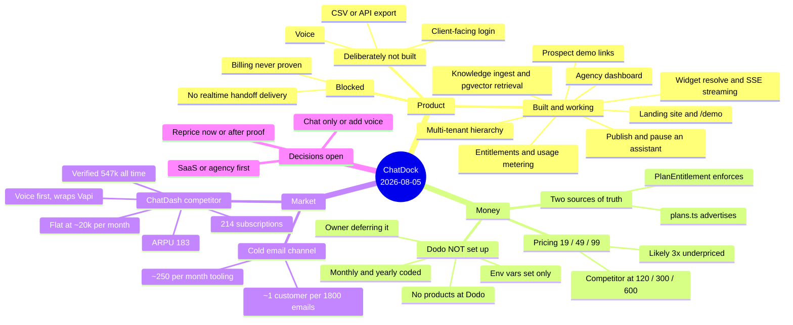

# START HERE

**Snapshot taken:** 2026-08-05, 12:43 PDT · **updated 13:25 PDT** (publish path
shipped; Dodo corrected to *not configured* on the owner's word)
**Commit at time of writing:** `05f5f0f` — working tree clean
**Deployed:** chatdock.io (Vercel, auto-deploys every push to `master`)

This is the entry point. Read this file first, then
[`ENGINEERING-HANDOFF.md`](ENGINEERING-HANDOFF.md) for the deep technical
detail. Everything below was verified against the code on the date above, not
copied from older docs — where an older doc disagrees, this file wins.

---

## The 60-second version

ChatDock is a multi-tenant SaaS. Agencies (web, SEO, lead-gen) launch a branded
"AI receptionist" chat widget on their own clients' websites. The agency pays;
the agency's clients get the widget; their visitors do the chatting.

The platform is built, the marketing site is live, and as of **2026-08-05 an
assistant can be published**, so a widget installed on a client's site now
answers. What is still missing before this can earn money: billing has never
processed a transaction (Dodo products not created — owner is doing this
later), and there is no way to share a prospect demo.

---

## Mind map

---

## The five steps, in order — step 1 is now done

Step 2 is waiting on the owner (Dodo). **The next thing to actually build is
step 4, shareable prospect demo links** — it needs no billing, and part of
step 3 (collapsing `plans.ts` into the database) is worth doing before the Dodo
products are created so the new prices are only entered once.

### 1. ~~Make it possible to publish an assistant~~ — **done 2026-08-05**

Was the P0 that blocked everything: nothing wrote `status: 'published'`, so
`src/lib/widget/resolve.ts:148` returned `403 assistant_unpublished` for every
`website_widget` deployment, forever.

Now shipped:

- `onSetAssistantStatus(workspaceId, 'published' | 'paused' | 'draft')` in
  `src/actions/settings/index.ts`, gated on
  `requireWorkspace(workspaceId, 'publishAssistant')`, with
  `onPublishAssistant` / `onPauseAssistant` wrappers and a read-only
  `onGetAssistantPublishState`
- `publishedAt` is stamped on **first** go-live and preserved across a
  pause/republish — "live since" is a number an agency reports to its client
- publishing with zero indexed chunks is allowed but returns a `warning`, since
  that assistant will decline every question
- UI: a Go live / Take offline control on the client overview
  (`src/components/clients/publish-toggle.tsx`) and next to the embed snippet in
  Settings, plus a "not published" banner on the overview and a matching card
  note on the roster

Pause is the same action inverted, so taking a client's widget offline no
longer means deleting data.

---

### 2. Prove the money path works — **deferred by the owner, 2026-08-05**

**Owner's call: Dodo is not set up yet and is being done later.** The
environment variables below exist, but the products behind them have not been
created on the provider side, so treat billing as unconfigured until that
happens. Do not plan work that depends on a working checkout.

Env state verified 2026-08-05 in `.env.local` (pulled from Vercel):

| Var | State |
|---|---|
| `DODO_API_KEY` | set |
| `DODO_WEBHOOK_SECRET` | set |
| `DODO_PRODUCT_ID_{STARTER,PRO,BUSINESS}` | set |
| `DODO_PRODUCT_ID_*_YEARLY` | set |
| `DODO_API_BASE` | **missing** — falls back to a default in code |

`src/actions/dodo/index.ts:18` already handles `MONTHLY | YEARLY`. So annual
billing is coded, not just planned.

**But no one has ever run a payment through it, and the provider-side products
do not exist.** Keys in an env file are not a payment system.

*Do (when the owner sets Dodo up):* create the products, then run one real
checkout in Dodo test mode. Confirm the webhook at
`src/app/api/dodo/webhook/route.ts` verifies its Standard Webhooks signature,
writes a `Subscription` row, and that `src/lib/entitlements.ts` then returns the
new plan's limits. Set `DODO_API_BASE` explicitly rather than relying on the
fallback.

*Done when:* a test purchase moves an organization from Free to Pro and the
workspace limit actually changes.

*Estimate:* half a day.

---

### 3. Reprice, and collapse the duplicate source of truth — **highest return**

Current: **$19 / $49 / $99**. A verified competitor (see Market intelligence)
charges **$120 / $300 / $600** for the same shape of product. Their blended
ARPU is $183.

At $49, $5,000 MRR needs **102 customers**. At $183 it needs **27**.

*Do:* raise the 5-workspace tier from $49 toward **$149**, create the matching
Dodo products, and update **both** sources at once:

- `src/lib/plans.ts` — what the site advertises
- `prisma/seed-plans.mjs` → `PlanEntitlement` — what actually gets enforced
- `src/components/landing/pricing-section.tsx`

**The trap:** these two disagree today and nothing keeps them in sync.
`src/lib/entitlements.ts` reads only the database; ten other files read only
`plans.ts`. Change one and the site will advertise limits the product does not
enforce. Fix the duplication as part of this step — have the pricing page read
plans server-side from the database, then delete `plans.ts`.

*Done when:* one source of truth, and the number on the pricing page is the
number `entitlements.ts` enforces.

*Estimate:* one day including the Dodo product setup.

---

### 4. ~~Ship shareable prospect demo links~~ — **done 2026-08-05**

An agency points ChatDock at a prospect's URL; it crawls that site, builds a
real assistant on it, and returns a public link at `/d/<shareToken>`. The
prospect opens it and talks to retrieval over their own content. The agency
sees whether it was opened, and converts it to a client in one click —
conversion is a status change, so the knowledge base, conversations and leads
the demo produced all survive.

`src/actions/demos/index.ts`, `src/app/(main)/d/[token]/page.tsx`, `/demos` in
the dashboard, 13 tests in `tests/security/prospect-demo.test.ts`. Full detail
and the decisions behind it are in [`BACKLOG.md`](BACKLOG.md) item 5.

What the seam looked like before it was built

`/demo` builds a working assistant from any URL in about 30 seconds. That is
the single strongest sales asset here: an agency can walk into a call with an
assistant already running on the prospect's own site.

The schema is fully ready and nothing uses it. Verified 2026-08-05:

| Seam | Where | Status |
|---|---|---|
| `workspaceType: prospect_demo` | `prisma/schema.prisma:258` | read-only |
| `shareToken` (unique) | `prisma/schema.prisma:429` | read at `widget/resolve.ts:83`, **never written** |
| `expiresAt` | schema | unused |
| `maximum_prospect_demos` | `src/lib/entitlements.ts:153` | enforced, never reached |
| "Demo" badges | `clients-grid.tsx`, `client-switcher.tsx` | render, never populated |

*Do:* a flow that creates a `prospect_demo` workspace, mints a `shareToken`,
sets an expiry, and returns a public link. See
[`outreach-demo-funnel-plan.md`](outreach-demo-funnel-plan.md), but note it was
written against the **legacy `Domain` schema** — its `isDemo`/`demoToken` design
is superseded by the fields above.

*Estimate:* two to three days.

---

### 5. Decide the go-to-market — **owner decision, not an engineering task**

Two paths, very different builds:

| | Sell ChatDock as SaaS | Run an agency, use ChatDock to deliver |
|---|---|---|
| To reach $5k MRR | 27–102 customers | 4–6 clients at ~$1,200/mo |
| Needs | self-serve onboarding, billing proven, support at scale | almost nothing extra |
| Time | 12+ months | 6–10 weeks |
| Produces | a business | revenue **and** the case studies the SaaS page lacks |

Steps 1–3 are required either way. Step 4 matters far more for the agency path.

**Recommendation on record (2026-08-05):** agency play first, capped at five
clients in one vertical, to fund runway and generate proof — then sell the SaaS
with real numbers on the page. The risk to manage is a services business
quietly eating the product business; cap it deliberately.

---

## State of play

| Area | Status | Evidence |
|---|---|---|
| Multi-tenancy and isolation | Working | 26 tests incl. a non-vacuity assertion |
| Knowledge ingest → retrieval | Working | `match_knowledge_chunks_scoped`, tenant arg required |
| Widget serve | Working | publish/pause shipped 2026-08-05; `onSetAssistantStatus` |
| Billing | **Not configured** | env vars set, but no products exist at Dodo; zero transactions. Owner is setting this up later |
| Landing site | Live | chatdock.io |
| `/demo` | Live and public | builds an assistant from any URL, stateless |
| Prospect demo links | Working | `/demos` → `/d/<shareToken>`, 13 tests |
| Realtime handoff | **Half-wired** | `pusher-client.ts` used by 2 hooks; `pusher-server.ts` imported by nothing — the app subscribes, nothing publishes |
| Voice | Not built, deliberate | schema accommodates it; do not build without a decision |
| Client-facing login | Not built | agency walks the client through instead |
| Export (CSV/API) | Not built | — |

---

## Market intelligence

### ChatDash — the closest competitor

Revenue verified by TrustMRR via Stripe API key (stronger than self-reported).

| | |
|---|---|
| All-time revenue | $547,338 |
| MRR (normalised) | $39,126 across **214 subscriptions** |
| ARPU | **$183** |
| Last 30 days cash | $20,323 in the page body, **down 14%** vs prior period. The same page's title said **$23,683** — the two disagree, so treat "roughly $20–24k/month" as the honest read, not a precise figure |
| Founded | April 2024 |
| Pricing | **$120 / $300 / $600** per month (3 / 5 / 10 clients) |
| Users | ~600, B2B, agencies |
| Domain Rating | 36 — not winning on SEO |
| Stated value prop | "Everything you need to deliver, manage, and monetize AI **voice agent** services for your clients — all under your brand" |

**Read it carefully.** $547,338 over ~28 months is ~$19.5k/month average, and
the last 30 days was $20.3k. They are **flat**, not compounding. The gap between
$39k normalised MRR and $20k monthly cash indicates a heavy **annual prepay**
mix — worth copying, and already supported in `src/actions/dodo/index.ts`.

Their own positioning has moved: the listing describes the product as a
Knowledge-Base dashboard with Voiceflow and OpenAI Assistants integrations,
while the headline value proposition sells **voice agent services**. The
knowledge-base half is the part ChatDock does natively and better; the voice
half is the part ChatDock does not do at all.

**What they are:** a white-label ops and billing layer for **voice** agents.
Their customers bring an agent from Retell, Vapi or ElevenLabs and pay for that
separately. They integrate GoHighLevel, HubSpot, Twilio, Google Calendar. They
also offer **performance-based billing** (per appointment, per lead) — ChatDock
has `BookingRequest`, `Lead` and append-only `UsageEvent`, so the data model
could support that; nothing exposes it.

**The wedge:** ChatDock is self-contained — crawl, embed, retrieve, answer, all
in-house. No second AI subscription. **The threat:** the money in this niche has
moved to voice, and ChatDock deliberately deferred it.

### Cold email channel maths

From a public case study (Koushik Bethu, *Operating System 4*), numbers
self-reported in a video that also sells his ebook — treat as one good campaign,
not a baseline:

- 5,332 emails → 2.4% reply (130) → 16 calls → 3 closed at $5,000/mo each
- ≈ **one customer per 1,777 emails**
- Tooling: Instantly + mailboxes + lead data ≈ **$210–300/month**

His pipeline auto-builds a personalised demo on reply using Voiceflow across
~15 steps. `/demo` does the same job from a URL in one. That is the reason step
4 exists.

*Caution:* his cold email claims the agent is already built when it is built
after the reply. The prospect noticed and said so. Do not copy that — it is the
fabrication pattern the landing-page rules in this repo explicitly forbid.

---

## Corrections log

Things previously written in this repo or asserted in planning that turned out
to be **false**. Recorded so nobody rebuilds on them.

| Claim | Reality | Found |
|---|---|---|
| "Dodo is configured" (asserted earlier on 2026-08-05 from `.env.local`) | Env vars are set and both billing periods are coded, but the **products were never created at Dodo**. Owner confirmed it is not set up and is deferring it. Env presence is not configuration | 2026-08-05, corrected same day |
| `STATUS.md`: "32 models, 54 enums" | 32 models, **42** enums — corrected in the file | 2026-08-05 |
| "ChatDash adds ~$1,400 MRR/month" | Bad arithmetic (all-time ÷ months = average revenue, not growth). They are flat at ~$20k/mo | 2026-08-05 |
| `outreach-demo-funnel-plan.md` design | Written against the legacy `Domain` schema; `isDemo`/`demoToken` superseded by `workspaceType`/`shareToken` | earlier |
| `docs/database-architecture.md` | Describes the **legacy** 16-model schema. Historical only | earlier |

---

## Where to go deeper

| Document | For |
|---|---|
| [`ENGINEERING-HANDOFF.md`](ENGINEERING-HANDOFF.md) | Repo map, request lifecycles, data-model invariants, tenancy enforcement, env vars, gotchas |
| [`rebuild/STATUS.md`](rebuild/STATUS.md) | Phase tracker and backlog |
| [`rebuild/authorization-and-entitlements.md`](rebuild/authorization-and-entitlements.md) | Permission and entitlement matrices |
| [`rebuild/dashboard-redesign.md`](rebuild/dashboard-redesign.md) | Dashboard IA and rationale |
| [`homepage-redesign.md`](homepage-redesign.md) | Marketing site design direction |
| [`../PRODUCT-OWNER-QUESTIONS.md`](../PRODUCT-OWNER-QUESTIONS.md) | Product decisions with the owner's answers |
