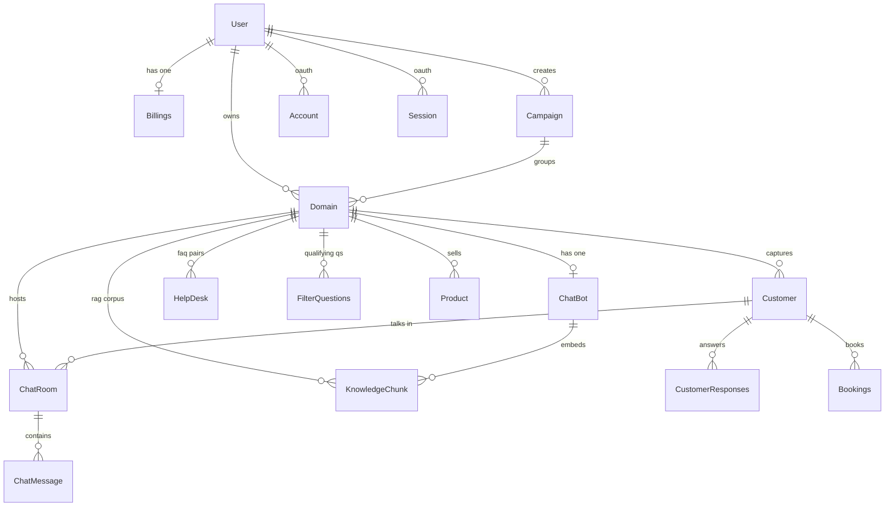

# ChatDock database architecture

Current state as of 2026-08-04, read from `prisma/schema.prisma`,
`supabase-vector-setup.sql`, `prisma/migrations/`, `migrations/` and the query
code in `src/lib/`.

## Stack

| Layer | What |
|---|---|
| Engine | PostgreSQL (Supabase) |
| Client | Prisma 5 (`@prisma/client`), `provider = "prisma-client-js"` |
| Connection | `DATABASE_URL` (pooled) + `DIRECT_URL` (direct, for migrations) |
| Vector search | `pgvector` extension, HNSW index, cosine distance |
| Embeddings | OpenAI `text-embedding-3-small` — **1536 dimensions** |
| IDs | `uuid` via `gen_random_uuid()` on every model except NextAuth tables |

**16 models · 3 enums.**

---

## Entity relationships



Ownership chain: `User → Domain → (ChatBot | Customer | ChatRoom | KnowledgeChunk | …)`.
Nearly every child uses `onDelete: Cascade`, so deleting a user or a domain
tears down its whole subtree.

---

## Models

### Identity & account

**`User`** — the agency.
| Field | Notes |
|---|---|
| `id` | uuid PK |
| `clerkId` | **unique** — the real auth key; Clerk owns authentication |
| `fullname`, `email`, `type` | |
| `dodoMerchantId` | Dodo Payments link |
| `agencyName` | default `"ChatDock"` |
| `agencyLogo`, `agencyColor` | agency white-label branding (`agencyColor` default `#0f172a`) |
| `agencyDomain` | **unique** — reserved for custom-domain white-labelling |
| `hideBranding` | bool, drives “Powered by” removal (Pro & Business) |

**`Account` / `Session` / `VerificationToken`** — standard NextAuth tables.
They exist in the schema but **Clerk is the live auth provider** (`clerkMiddleware`
in `src/middleware.ts`). Treat these as vestigial unless something proves otherwise.

**`Billings`** — one per user (`userId` unique).
| Field | Notes |
|---|---|
| `plan` | `Plans` enum, default `FREE` |
| `messageCredits` | pool for the billing period, default 100 |
| `messagesUsed` | consumed this period |
| `messagesResetAt` | rolling 30-day reset, checked lazily on each chat request |
| `billingInterval` | `MONTHLY` / `YEARLY` |
| `provider`, `providerSubscriptionId` (unique), `status`, `cancelAtPeriodEnd`, `endsAt` | Dodo subscription state |

> Credits are **pooled per user, not per domain.** Every client workspace draws
> from the same bucket, and exhaustion 429s every bot that user owns
> (`src/app/api/bot/stream/route.ts:185`).

### The client workspace

**`Domain`** — one client website = one workspace. This is the unit `PLAN_LIMITS.domains` caps.
| Field | Notes |
|---|---|
| `name`, `icon` | |
| `userId` | owner, nullable, cascade delete |
| `campaignId` | optional grouping |
| `knowledgeBaseSizeMB` | float, enforced against `PLAN_LIMITS.knowledgeBaseMB` |
| `trainingSourcesUsed` | int, enforced against `PLAN_LIMITS.trainingSources` |

Indexes: `userId`, `campaignId`.

**`ChatBot`** — 1:1 with `Domain` (`domainId` unique). All assistant config.
- Appearance: `welcomeMessage`, `icon`, `background`, `textColor`, `theme` (JSONB)
- Behaviour: `mode` (default `SALES`), `brandTone`, `language`, `helpdesk`
- Model config: `llmModel` (default `gemini-2.5-flash-lite`), `llmTemperature`, `modePrompts` (JSONB)
- Knowledge: `knowledgeBase` (raw text), `knowledgeBaseUpdatedAt`, `knowledgeBaseStatus`
- Embedding job state: `embeddingStatus`, `embeddingProgress`, `embeddingChunksTotal`, `embeddingChunksProcessed`, `embeddingCompletedAt`, `hasEmbeddings`

**`HelpDesk`** — curated Q&A pairs per domain.
**`FilterQuestions`** — the qualifying questions the assistant asks (`question`, `answered`).
**`Product`** — `name`, `price` (Int), `image`, per domain.

### Conversations & leads

**`Customer`** — a captured lead. `@@unique([email, domainId])` enables safe upsert
(added by `migrations/fix_customer_unique_constraint.sql` to kill a race condition).

**`ChatRoom`** — one conversation thread.
- `live` — **human takeover flag**; this is what powers agent handoff
- `mailed` — notification sent
- `anonymousId` — indexed, tracks visitors who never left an email
- Belongs to `Domain`, optionally to `Customer`

**`ChatMessage`** — `message`, `role` (`user` | `assistant`), `seen`, `chatRoomId`.

**`CustomerResponses`** — the lead's answers to `FilterQuestions`.

**`Bookings`** — `date`, `slot`, `email`, `customerId`, `domainId`.
Note: `domainId` is a plain column here — **no FK relation, no index in the
schema** (the index exists only in `prisma/migrations/add_missing_indexes.sql`).

**`Campaign`** — email marketing. `customers String[]`, `template`.

---

## The RAG layer

**`KnowledgeChunk`** is the retrieval corpus and the one model Prisma does not
fully manage:

```prisma
embedding  Unsupported("vector")?
```

Prisma cannot read or write that column, so all vector work goes through raw SQL
in `src/lib/vector-search.ts` via `client.$queryRaw`.

| Field | Notes |
|---|---|
| `domainId`, `chatBotId` | both FK, both cascade |
| `content` | the chunk text |
| `embedding` | `vector(1536)` |
| `sourceType` | indexed — website / document / etc. |
| `sourceUrl`, `sourceName` | provenance, powers the "answered from /services" citation |

**Infrastructure created by `supabase-vector-setup.sql`, not by Prisma:**
- `CREATE EXTENSION vector`
- HNSW index: `USING hnsw (embedding vector_cosine_ops)`
- RPC `match_knowledge_chunks(query_embedding, match_threshold, match_count, …)`

Retrieval path: query → `generateEmbedding` (OpenAI, 1536-d) → pgvector cosine
search → optional Jina rerank → context. `vector-search.ts` also has a multi-query
path that batch-embeds several rewrites and searches them in parallel.

---

## Enums

```prisma
enum Plans           { FREE  STARTER  PRO  BUSINESS }
enum BillingInterval { MONTHLY  YEARLY }
enum Role            { user  assistant }
```

`Plans` must stay in sync with `PlanType` in `src/lib/plans.ts` and with the card
titles the settings surfaces look plans up by.

---

## Indexes

Declared in the schema: `Domain(userId)`, `Domain(campaignId)`, `HelpDesk(domainId)`,
`FilterQuestions(domainId)`, `Customer(domainId)`, `ChatRoom(domainId)`,
`ChatRoom(anonymousId)`, `ChatMessage(chatRoomId)`, `Product(domainId)`,
`KnowledgeChunk(domainId)`, `KnowledgeChunk(chatBotId)`, `KnowledgeChunk(sourceType)`.

Uniques: `User.clerkId`, `User.agencyDomain`, `ChatBot.domainId`,
`Billings.userId`, `Billings.providerSubscriptionId`, `Customer(email, domainId)`,
`Session.sessionToken`, `Account(provider, providerAccountId)`.

Additional indexes live only in loose SQL — see the operational note below:
`CustomerResponses(customerId)`, `Bookings(customerId)`, `Bookings(domainId)`,
`Campaign(userId)`.

---

## Operational reality — read before changing the schema

**There is no managed migration history.** `package.json` runs
`prisma generate && next build` — **not** `prisma migrate deploy`. The
`prisma/migrations/` folders have no `migration_lock.toml` and are hand-written
`ALTER TABLE ... IF NOT EXISTS` scripts, and several schema changes live as loose
SQL files at the repo root:

- `supabase-vector-setup.sql` — extension, KnowledgeChunk table, HNSW index, RPC
- `add-chatbot-embedding-fields.sql` — the `embedding*` columns on ChatBot
- `migrations/fix_customer_unique_constraint.sql` — the Customer unique constraint
- `prisma/migrations/add_missing_indexes.sql` — the four indexes above
- `setup-dev-db.sql`

So the schema is applied **by pasting SQL into the Supabase SQL editor**, and
`schema.prisma` is the intended state rather than a guaranteed reflection of what
is actually in the database.

Consequences for any schema work (including the demo-funnel plan):
1. **Verify the live database before trusting the schema file.** Drift is likely
   in exactly the places that were patched by hand.
2. Write changes as idempotent `ALTER TABLE ... IF NOT EXISTS` SQL, matching the
   existing convention, and update `schema.prisma` in the same commit.
3. Anything involving `KnowledgeChunk.embedding` must be raw SQL — Prisma cannot
   express it.
4. Adopting `prisma migrate` properly would need a baseline against the live DB
   first. Worth doing, but it is its own task, not something to bundle into a
   feature.
